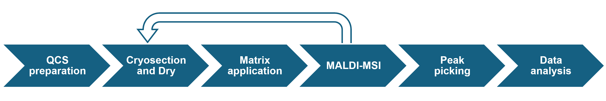
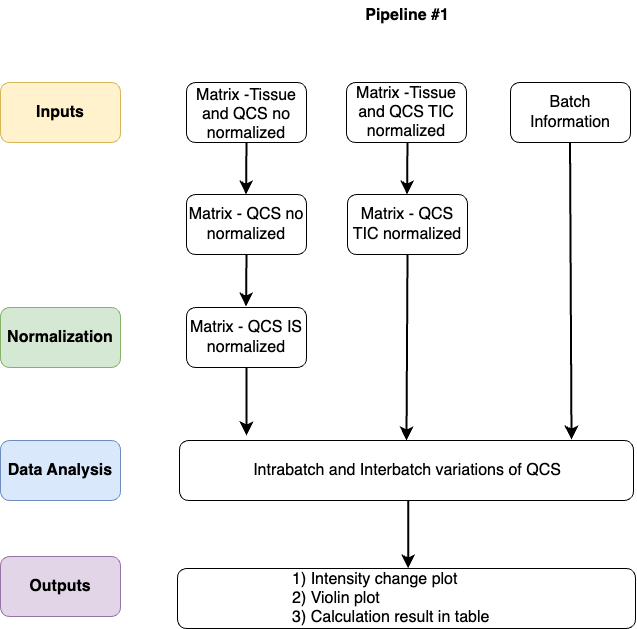
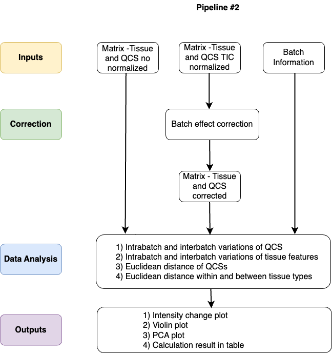

<h1>Quality Control Standard Pipeline</h1> 
<h3><b>Paper: ** Luo's Paper Link **</b></h3>

<p>The Quality Control Standard (QCS) pipeline is designed to help MALDI-MSI (Matrix-assisted laser desorption/ionization mass spectrometry imaging) users evaluate and correct batch effects in their experiments. This pipeline employs a novel Quality Control Standard, created by the Berta-Cillero group at the MERLN Institute in Maastricht, to monitor and control technical variations (reference). By integrating this standard, the pipeline ensures consistency across experiments, providing a reliable method for addressing technical variation in MALDI-MSI data.</p>

<div align="center">
  
  <p><em>Figure 1: Workflow of Quality Control Standard.</em></p>
</div>


<p>The pipeline consists of three notebooks: Tutorial, Pipeline #1, and Pipeline #2.</p>

<table align="center">
  <tr>
    <td style="padding-right: 100px;">
      
      <p style="text-align: center;"><em>Figure 2: Pipeline 1 workflow</em></p>
    </td>
    <td>
      
      <p style="text-align: center;"><em>Figure 3: Pipeline 2 workflow</em></p>
    </td>
  </tr>
</table>

<p>* <b>Tutorial</b> is designed to guide users in using the pipeline. It demonstrates how we used the pipeline in "Luo's paper," where we conducted a three-day metabolomics batch test to demonstrate the novel QCS's sensitivity to technical variations.</p>

<p>* <b>Pipeline #1</b> is designed to evaluate and correct intrabatch and interbatch variations occurring only in the QCS samples using Total Ion Count normalization or Internal Standard normalization. The measure of technical variation is based on calculating the relative standard deviation (RSD) of the QCS standard. It is recommended to first run Pipeline #1, as this can help determine any slide outliers or identify issues with sample preparation or measurement before moving on to correct batch effects in Pipeline #2.</p>

<p>* <b>Pipeline #2</b> is designed to evaluate intrabatch and interbatch variations in both QCS samples and tissue sections prepared from artificially created tissue homogenate. It allows users to correct batch effects using various methods such as <a href="https://pubmed.ncbi.nlm.nih.gov/16632515/" target="_blank">Combat (Johnson et al., 2007)</a> (Github:https://github.com/jtleek/sva), <a href="https://pubmed.ncbi.nlm.nih.gov/30926040/" target="_blank">WaveICA (Deng et al., 2019)</a> (Github:https://github.com/dengkuistat/WaveICA), <a href="https://pubmed.ncbi.nlm.nih.gov/32207605/" target="_blank">NormAE (Rong et al., 2020)</a> (Github:https://github.com/luyiyun/NormAE), Total Ion Count normalization, and Internal Standard normalization. The measure of technical variation is based on calculating the relative standard deviation (RSD) of the QCS standard and detected tissue features. The QCS RSD is regarded as a general indicator of overall technical variations derived from the MALDI-MSI workflow. The tissue feature RSD can be regarded as an indicator of intragroup variations and can vary across features. Tissue feature variation is more complex and can be influenced by many factors, such as sample heterogeneity and various batch effects. In our showcase, we used artificially created tissue homogenate; the tissue feature RSD is more representative of technical variations and was used as a reference to evaluate the practicability of applying QCS to reflect tissue variations in real cases. Additionally, the corrective effect on the clustering of tissue samples can also be assessed via Principal Component Analysis (PCA).</p>

<p> As proposed in the diagram, the input used for this pipeline are no normalization dataset, TIC normalization dataset, and batch information. The no normalization dataset means a CSV file obtained from SCiLS Lab software </p>

<p>As proposed in the diagram, the inputs used for this pipeline include a non-normalized dataset, a TIC-normalized dataset, and batch information. The non-normalized dataset refers to a CSV file obtained from SCiLS Lab software.</p> 

<p>The batch correction methods used, such as Combat, WaveICA, NormAE, Total Ion Count (TIC) normalization, and Internal Standard (IS) normalization, are commonly applied in metabolomics, transcriptomics, and genomics data analysis. Data normalization methods like TIC and IS normalization ensure sample comparability by scaling the samples to a consistent scale. Combat is a location-scale correction method that uses a Bayesian framework to estimate and remove batch effects by adjusting the mean and variance of the data (Johnson et al., 2007). It is applied in transcriptomics, proteomics, and metabolomics data. WaveICA is a matrix factorization method that transforms the data into wavelets with independent component analysis (ICA) to remove batch effects and is commonly used in metabolomics (Deng et al., 2019). NormAE is a deep learning-based method that uses an autoencoder neural network to learn and remove batch effects, primarily applied in metabolomics (Rong et al., 2020).</p>

--- 

<h3>Paper: **Luo's paper name** </h3>

--- 
<h2>Table of Contents</h2> 
<p><b>Installation and usage</b></p>
<p><b>How to use</b></p>
<p><b>Reference</b></p>

<h2>Installation and Usage</h2> 
<p>To run the pipeline, users have several options depending on their setup and preferences. Below are examples of how to use the file in Jupyter Notebook, VS Code, and Anaconda. For online execution, users can also run the Jupyter Notebook on Google Colab.</p> <p><b>If you would like to run the pipeline via Anaconda, you can follow this setup:</b></p> <ul> <li>Install Anaconda from <a href="https://www.anaconda.com/">https://www.anaconda.com/</a></li> <li>Set up an R environment by following the instructions at <a href="https://docs.anaconda.com/free/working-with-conda/packages/using-r-language/#">this link</a></li> <li>Activate the newly created R environment</li> <li>Install the R package <code>IRkernel</code></li> <li>Open JupyterLab through Anaconda Navigator or the Anaconda Prompt</li> <li>Open the file <code>Pipeline_#1.ipynb</code> to run</li> </ul> <p><b>If you would like to run the pipeline via Visual Studio Code, you can follow this setup:</b></p> <ul> <li>Install R version 4.3.3 from <a href="https://www.r-project.org/">https://www.r-project.org/</a></li> <li>Install the R package <code>IRkernel</code></li> <li>Install Python version 3.3 or greater from <a href="https://www.python.org/downloads/">https://www.python.org/downloads/</a></li> <li>Install the Python library <code>jupyter</code></li> <li>Install Visual Studio Code from <a href="https://code.visualstudio.com/">https://code.visualstudio.com/</a></li> <li>Set up Visual Studio Code to work with R by following instructions from <a href="https://code.visualstudio.com/docs/languages/r">this link</a></li> <li>Open the file <code>Pipeline_#1.ipynb</code> in Visual Studio Code</li> <li>Select <code>Kernel</code> → <code>Jupyter Kernel</code> → <code>R</code> (from the computer)</li> <li>Run <code>Pipeline_#1.ipynb</code></li> </ul>

<h2>How to use</h2>
<h3>Data preparation</h3>
<p><b>metabolomics_data</b> (no normalization / TIC normalization dataset obtained from SCiLS Lab)</p>
<p>You can obtain the dataset CSV file from SCiLS Lab and it will look like below for instance where it contains m/z value and its peak data in one row for each m/z values.</p> 

```
  # Exported with SCiLS Lab Version ??.??.?????
  # Export time: ????-??-?? ??:??:?? 
  # Generated from file:     
  # Object Full Name: All Features
  # Object ID: afad0ade-9e2e-43bb-9aea-72ec417ef666
  # Object type: Static feature list
  # Object creation time: 2024-04-08 15:47:14
  #
  m/z;Interval Width (+/- Da);Color;Name;Peak area - S1_ChickenHeart_1 - Total Ion Count;Peak area - S1_QCS_1 - Total Ion Count;Peak area - S1_QCS_2 - Total Ion Count;Peak area - S1_QCS_3 - Total Ion Count;Peak area - S1_QCS_4 - Total Ion Count;Peak area - S1_QCS_5 - Total Ion Count;Peak area - S1_QCS_6 - Total Ion Count;
  260.186;0.39999999999998;#ff0000;;22.273368835449;29.65258789062;315.71942138972;185.962890625;166.5977935791;161.48960876465;303.46649169922;
  267.187;0.39999999999998;#33a02c;;15.246510505676;252.85493469238;223.50448608398;104.59754943848;100.75203704834;120.63928222656;192.14392089844;
```


<p><b>batch_information </b> (batch information file) is created by yourself as CSV file where it contains the name of peak data and injection order and batch number.</p>

```
sample.name	injection.order	batch
Peak area - S1_ChickenHeart_1 - Total Ion Count	1	1
Peak area - S1_QCS_1 - Total Ion Count	2	1
Peak area - S1_QCS_2 - Total Ion Count	3	1
Peak area - S1_QCS_3 - Total Ion Count	4	1
Peak area - S1_QCS_4 - Total Ion Count	5	1
Peak area - S1_QCS_5 - Total Ion Count	6	1
Peak area - S1_QCS_6 - Total Ion Count	7	1
Peak area - S2_ChickenHeart_2 - Total Ion Count	8	1
Peak area - S2_QCS_1 - Total Ion Count	9	1
Peak area - S2_QCS_2 - Total Ion Count	10	1
Peak area - S2_QCS_3 - Total Ion Count	11	1
Peak area - S2_QCS_4 - Total Ion Count	12	1
Peak area - S2_QCS_5 - Total Ion Count	13	1
Peak area - S2_QCS_6 - Total Ion Count	14	1
```

<h2>References</h2>
Johnson, W. E., Li, C., & Rabinovic, A. (2007). Adjusting batch effects in microarray expression data using empirical Bayes methods. Biostatistics, 8(1), 118-127. doi: 10.1093/biostatistics/kxj037. PMID: 16632515.

Deng, K., Zhang, F., Tan, Q., Huang, Y., Song, W., Rong, Z., Zhu, Z. J., Li, K., & Li, Z. (2019). WaveICA: A novel algorithm to remove batch effects for large-scale untargeted metabolomics data based on wavelet analysis. Analytica Chimica Acta, 1061, 60-69. doi: 10.1016/j.aca.2019.02.010. PMID: 30926040.

Rong, Z., Tan, Q., Cao, L., Zhang, L., Deng, K., Huang, Y., Zhu, Z. J., Li, Z., & Li, K. (2020). NormAE: Deep Adversarial Learning Model to Remove Batch Effects in Liquid Chromatography Mass Spectrometry-Based Metabolomics Data. Analytical Chemistry, 92(7), 5082-5090. doi: 10.1021/acs.analchem.9b05460. PMID: 32207605.
