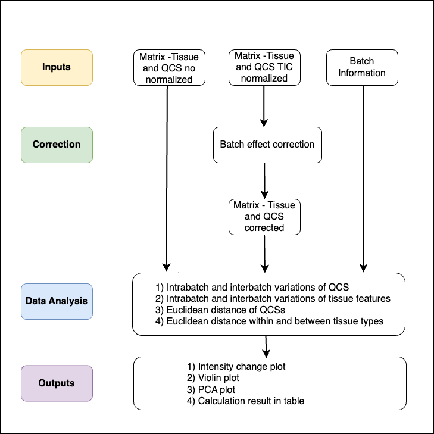

<h1>Quality Control Standard Pipeline</h1> 

<p>This pipeline functions as a companion computational pipeline, designed to integrate seamlessly with our established Quality Control Standards (QCSs) within mass spectrometry imaging (MSI) workflows [our paper reference]. It aims to provide data analysis capabilities including monitoring of batch data quality, correction of batch effects, and pre- and post-evaluation.</p>


Workflow |
:-------------------------:|
  | 
<em>Figure 1: General MSI workflow for applying QCSs to tissue slide measurement and assessing data quality across slides.</em>

<p>The pipeline consists of two notebooks: Pipeline #1, and Pipeline #2.</p>

Pipeline 1            |  Pipeline 2
:-------------------------:|:-------------------------:
  |  
<em>Figure 2: Pipeline 1 diagram applied for QCS samples.</em> | <em>Figure 3: Pipeline 2 diagram applied for QCS samples and tissue sections.</em>

<p>* <b>Pipeline #1</b> is designed to evaluate and correct intrabatch and interbatch variations occurring only in the QCS samples using Total Ion Count normalization or Internal Standard normalization. The measure of technical variation is based on calculating the relative standard deviation (RSD) of the QCS standard. It is recommended to first run Pipeline #1, as this can help determine any slide outliers or identify issues with sample preparation or measurement before moving on to correct tissue samples batch effects in Pipeline #2.</p>

<p>* <b>Pipeline #2</b> is designed to evaluate intrabatch and interbatch variations in both QCS samples and tissue sections. It allows users to correct batch effects using various methods such as <a href="https://pubmed.ncbi.nlm.nih.gov/16632515/" target="_blank">Combat (Johnson et al., 2007)</a> (Github:https://github.com/jtleek/sva), <a href="https://pubmed.ncbi.nlm.nih.gov/30926040/" target="_blank">WaveICA (Deng et al., 2019)</a> (Github:https://github.com/dengkuistat/WaveICA), <a href="https://pubmed.ncbi.nlm.nih.gov/32207605/" target="_blank">NormAE (Rong et al., 2020)</a> (Github:https://github.com/luyiyun/NormAE), Total Ion Count normalization, and Internal Standard normalization. The measure of technical variation is based on calculating the relative standard deviation (RSD) of the QCS standard and detected tissue features. The QCS RSD is regarded as a general indicator of overall technical variations derived from the MALDI-MSI workflow. The tissue feature RSD can be regarded as an indicator of intragroup variations and can vary across features. Tissue feature variation is more complex and can be influenced by many factors, such as sample heterogeneity and various batch effects. In our showcase, we used artificially created tissue homogenate; the tissue feature RSD is more representative of technical variations and was used as a reference to evaluate the practicability of applying QCS to reflect tissue variations in real cases. Additionally, the corrective effect on the clustering of tissue samples can also be assessed via Principal Component Analysis (PCA).</p>

--- 

<h3>Paper: **Luo's paper name** </h3>

--- 
<h2>Table of Contents</h2> 
<p><b>Installation and usage</b></p>
<p><b>How to use</b></p>
<p><b>Reference</b></p>

<h2>Installation and Usage</h2> 

<p>To run the pipeline in a Jupyter Notebook, users can choose from multiple options based on
their setup and preferences:</p>

1. Online Execution: Quickly get started using Google Colab, which allows you to run the
pipeline in a cloud-based environment without any local setup.
2. Local Execution: Run the pipeline on your local machine using Jupyter Notebook, VS Code,
or Anaconda, depending on your preferred tool.
Additionally, the pipeline is also available as R Markdown files for those who prefer working in
an R-based environment.

<h2>How to use</h2>
<h3>Input data preparation</h3>
<p><b>metabolomics_data</b> (no normalization / TIC normalization dataset obtained from SCiLS Lab)</p>
<p>You can obtain the dataset CSV file from SCiLS Lab, as shown below.</p> 

```
  # Exported with SCiLS Lab Version ??.??.?????
  # Export time: ????-??-?? ??:??:?? 
  # Generated from file:     
  # Object Full Name: All Features
  # Object ID: afad0ade-9e2e-43bb-9aea-72ec417ef666
  # Object type: Static feature list
  # Object creation time: 2024-04-08 15:47:14
  #
  m/z;Interval Width (+/- Da);Color;Name;Peak area - S1_ChickenHeart_1 - Total Ion Count;Peak area - S1_QCS_1 - Total Ion Count;Peak area - S1_QCS_2 - Total Ion Count;Peak area - S1_QCS_3 - Total Ion Count;Peak area - S1_QCS_4 - Total Ion Count;Peak area - S1_QCS_5 - Total Ion Count;Peak area - S1_QCS_6 - Total Ion Count;
  260.186;0.39999999999998;#ff0000;;22.273368835449;29.65258789062;315.71942138972;185.962890625;166.5977935791;161.48960876465;303.46649169922;
  267.187;0.39999999999998;#33a02c;;15.246510505676;252.85493469238;223.50448608398;104.59754943848;100.75203704834;120.63928222656;192.14392089844;
```


<p><b>batch_information </b> (batch information file) is created by yourself as CSV file where it contains the name of peak data and injection order and batch number.</p>

```
sample.name	injection.order	batch
Peak area - S1_ChickenHeart_1 - Total Ion Count	1	1
Peak area - S1_QCS_1 - Total Ion Count	2	1
Peak area - S1_QCS_2 - Total Ion Count	3	1
Peak area - S1_QCS_3 - Total Ion Count	4	1
Peak area - S1_QCS_4 - Total Ion Count	5	1
Peak area - S1_QCS_5 - Total Ion Count	6	1
Peak area - S1_QCS_6 - Total Ion Count	7	1
Peak area - S2_ChickenHeart_2 - Total Ion Count	8	1
Peak area - S2_QCS_1 - Total Ion Count	9	1
Peak area - S2_QCS_2 - Total Ion Count	10	1
Peak area - S2_QCS_3 - Total Ion Count	11	1
Peak area - S2_QCS_4 - Total Ion Count	12	1
Peak area - S2_QCS_5 - Total Ion Count	13	1
Peak area - S2_QCS_6 - Total Ion Count	14	1
```

<h2>References</h2>

1. Johnson, W. E., Li, C., & Rabinovic, A. (2007). Adjusting batch effects in microarray expression data using empirical Bayes methods. Biostatistics, 8(1), 118-127. doi: 10.1093/biostatistics/kxj037. PMID: 16632515.

2. Deng, K., Zhang, F., Tan, Q., Huang, Y., Song, W., Rong, Z., Zhu, Z. J., Li, K., & Li, Z. (2019). WaveICA: A novel algorithm to remove batch effects for large-scale untargeted metabolomics data based on wavelet analysis. Analytica Chimica Acta, 1061, 60-69. doi: 10.1016/j.aca.2019.02.010. PMID: 30926040.

3. Rong, Z., Tan, Q., Cao, L., Zhang, L., Deng, K., Huang, Y., Zhu, Z. J., Li, Z., & Li, K. (2020). NormAE: Deep Adversarial Learning Model to Remove Batch Effects in Liquid Chromatography Mass Spectrometry-Based Metabolomics Data. Analytical Chemistry, 92(7), 5082-5090. doi: 10.1021/acs.analchem.9b05460. PMID: 32207605.
