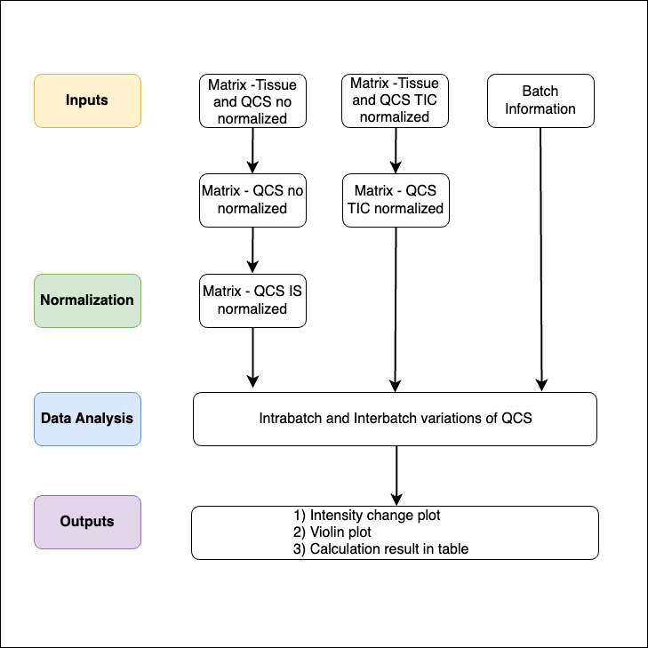

<h1>Quality Control Standard Pipeline</h1>
<p>The Quality Control Standard (QCS) pipeline was developed to help MALDI-MSI (Matrix-assisted laser desorption/ionization mass spectrometry imaging) users evaluate and correct batch effects in their experiments. This pipeline employs a novel Quality Control Standard, created by the Berta-Cillero group at the MERLN Institute in Maastricht, to monitor and control technical variations. By integrating this standard, the pipeline ensures consistency across experiments, providing a reliable method for addressing technical variation in MALDI-MSI data.</p>

<div align="center">
  
  <p><em>Figure 1: Workflow of Quality Control Standard.</em></p>
</div>


<p>The pipeline consists of three notebooks: Tutorial, Pipeline #1, and Pipeline #2.</p>

<table align="center">
  <tr>
    <td style="padding-right: 100px;">
      
      <p style="text-align: center;"><em>Figure 2: Pipeline 1 workflow</em></p>
    </td>
    <td>
      
      <p style="text-align: center;"><em>Figure 3: Pipeline 2 workflow</em></p>
    </td>
  </tr>
</table>

<p>* <b>Tutorial</b> is designed to guide users using the pipeline. It will demonstrate how we used the pipeline for experiment in "Luo's paper" where we conducted a three-day metabolomics batch test to demonstrate the novel QCS's sensitivity to technical variations.</p>

<p>* <b>Pipeline #1</b> is designed to evaluate and correct intra- and interday batch effects occurring in the QCS samples using Internal Standard Normalization. To evaluate batch effects, we used relative standard deviation (RSD) to measure of the variation occurring in the samples.</p>

<p>* <b>Pipeline #2</b> is used to assess intra- and interday batch effects in both QCS samples and artificially created tissue homogenate samples. It allows users to correct batch effects using various methods such as Combat, WaveICA, and NormAE, Total Ion Count normalization, and Internal Standard normalization. To evaluate batch effects, we used relative standard deviation (RSD) to measure the coefficient of variation occurring in the samples. As well, we perform Principal Component Analysis and assess their clusterness to evaluate the similarity of samples.</p> 

<p> As proposed in the diagram, the input used for this pipeline are no normalization dataset, TIC normalization dataset, and batch information. The no normalization dataset means a CSV file obtained from SCiLS Lab software </p>

<p> The batch correction methods used such as Combat, WaveICA, NormAE, Total Ion Count normalization, and Internal Standard normalizations are currently used batch correction methods in metabolomics, transcriptomics, and genomics data analysis.</p>

--- 

<h3>Paper: **Luo's paper name** </h3>

--- 
<h2>Table of Contents</h2> 
<p><b>Requirements</b></p>
<p><b>How to use</b></p>

<h2>Requirements</h2>
<p>Visual Code Studio or Anaconda </p>

<h2>How to use</h2>
<h3>Data preparation</h3>
<p>metabolomics_data (no normalization / TIC normalization dataset obtained from SCiLS Lab)</p>
<p>You can obtain the dataset CSV file from SCiLS Lab and it will look like below for instance where it contains m/z value and its peak data in one row for each m/z values.</p> 

```
  # Exported with SCiLS Lab Version ??.??.?????
  # Export time: ????-??-?? ??:??:?? 
  # Generated from file:     
  # Object Full Name: All Features
  # Object ID: afad0ade-9e2e-43bb-9aea-72ec417ef666
  # Object type: Static feature list
  # Object creation time: 2024-04-08 15:47:14
  #
  m/z;Interval Width (+/- Da);Color;Name;Peak area - S1_ChickenHeart_1 - Total Ion Count;Peak area - S1_QCS_1 - Total Ion Count;Peak area - S1_QCS_2 - Total Ion Count;Peak area - S1_QCS_3 - Total Ion Count;Peak area - S1_QCS_4 - Total Ion Count;Peak area - S1_QCS_5 - Total Ion Count;Peak area - S1_QCS_6 - Total Ion Count;
  260.186;0.39999999999998;#ff0000;;22.273368835449;29.65258789062;315.71942138972;185.962890625;166.5977935791;161.48960876465;303.46649169922;
  267.187;0.39999999999998;#33a02c;;15.246510505676;252.85493469238;223.50448608398;104.59754943848;100.75203704834;120.63928222656;192.14392089844;
```


<p>batch_information (batch information file) is created by yourself as CSV file where it contains the name of peak data and injection order and batch number.</p>

```
sample.name	injection.order	batch
Peak area - S1_ChickenHeart_1 - Total Ion Count	1	1
Peak area - S1_QCS_1 - Total Ion Count	2	1
Peak area - S1_QCS_2 - Total Ion Count	3	1
Peak area - S1_QCS_3 - Total Ion Count	4	1
Peak area - S1_QCS_4 - Total Ion Count	5	1
Peak area - S1_QCS_5 - Total Ion Count	6	1
Peak area - S1_QCS_6 - Total Ion Count	7	1
Peak area - S2_ChickenHeart_2 - Total Ion Count	8	1
Peak area - S2_QCS_1 - Total Ion Count	9	1
Peak area - S2_QCS_2 - Total Ion Count	10	1
Peak area - S2_QCS_3 - Total Ion Count	11	1
Peak area - S2_QCS_4 - Total Ion Count	12	1
Peak area - S2_QCS_5 - Total Ion Count	13	1
Peak area - S2_QCS_6 - Total Ion Count	14	1
```


<p>Each pipeline consist of its own read me to follow through.<p>


